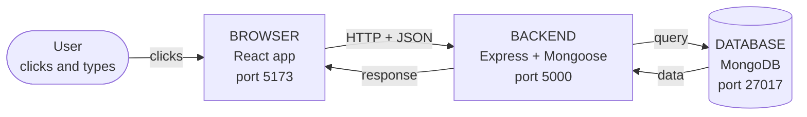
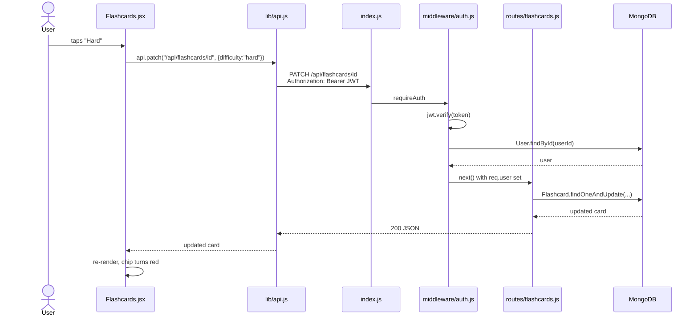
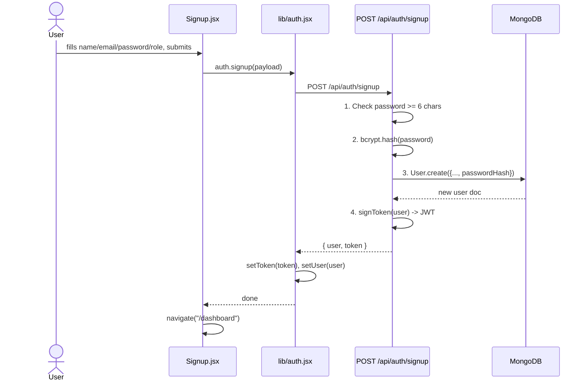
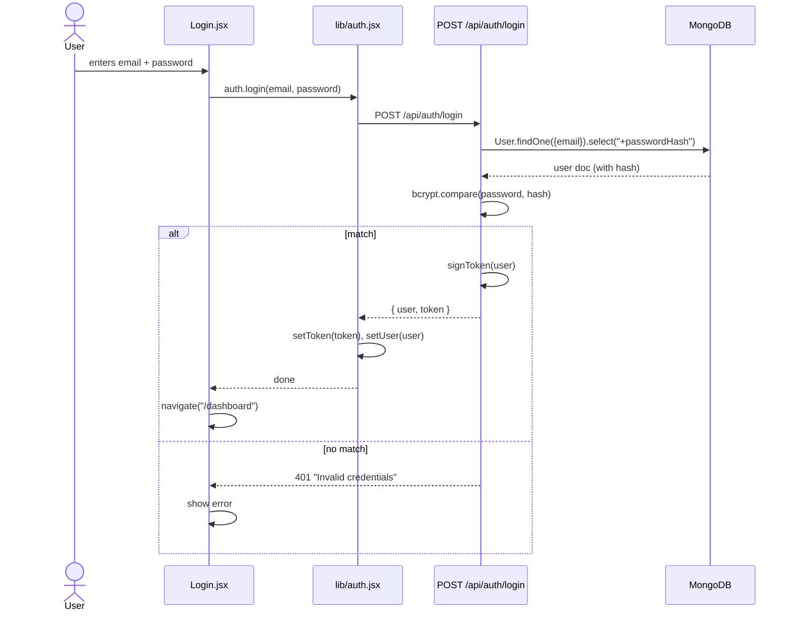
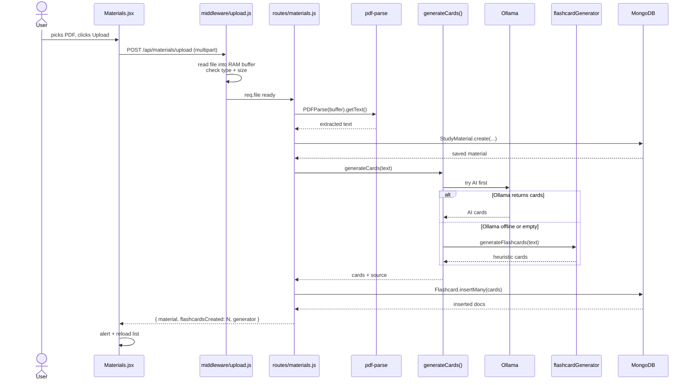
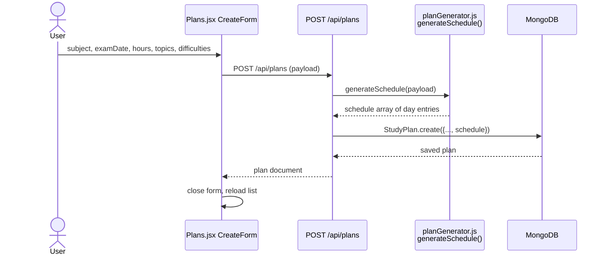
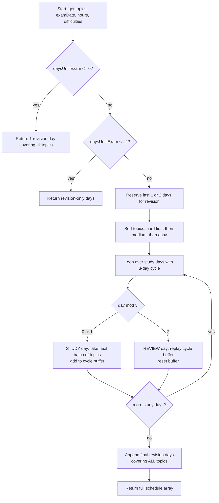

# FLASHMASTER - Complete Code Explanation + Flow Diagrams

Use this as your reading guide for the project and your speaking script for the video.

> **To see the diagrams as real pictures** (not code):
> - **On GitHub**: already renders automatically - just push this file and open it on github.com
> - **In VS Code**: install the extension **"Markdown Preview Mermaid Support"** (publisher: bierner), then open this file and press `Ctrl+Shift+V` to preview
> - **Online viewer**: paste any diagram block into https://mermaid.live to see it instantly
> - **For your report/slides**: open mermaid.live, paste the diagram, click "Actions" -> export PNG/SVG

---

## PART 0 - THE BIG PICTURE

FLASHMASTER is built on the **MERN** stack. MERN = four letters, four things:

| Letter | Name | What it does | Where in our project |
|---|---|---|---|
| M | MongoDB | Database - stores data as "documents" (like JSON objects) | Runs on your laptop at `mongodb://localhost:27017` |
| E | Express | Backend web framework - handles HTTP requests | `backend/src/index.js` starts an Express app |
| R | React | Frontend UI library - builds the interface the user sees | `frontend/src/` is a React app |
| N | Node.js | Runtime - lets JavaScript run outside the browser | Both backend AND the build tools are Node |

### How the 4 pieces fit together



- The **user** only talks to the **browser**.
- The **browser** only talks to the **backend** over HTTP (we call these "API requests").
- The **backend** is the only thing that talks to the **database**.

So when you click "Sign up" in the browser:
1. React sends a POST request to the backend's `/api/auth/signup`.
2. Express receives it, hashes the password, and asks MongoDB to save a new user.
3. MongoDB stores the user and returns it.
4. Express sends back a JWT token.
5. React saves the token in localStorage and shows the dashboard.

---

## PART 1 - PROJECT FOLDER TOUR

```
FLASHCARDS/
├── README.md              <- public project overview
├── package.json           <- runs both servers with `npm run dev`
├── backend/               <- Express + Mongoose (the "server")
│   └── src/
│       ├── index.js       <- entry point, wires up Express
│       ├── config/        <- db.js (MongoDB connection)
│       ├── middleware/    <- auth.js (JWT check), upload.js (file upload)
│       ├── models/        <- Mongoose schemas: User, StudyMaterial, ...
│       ├── routes/        <- all /api/* URL handlers
│       └── services/      <- flashcardGenerator, planGenerator, ollamaGenerator
└── frontend/              <- React + Vite + Tailwind
    └── src/
        ├── main.jsx       <- React entry point
        ├── App.jsx        <- router setup
        ├── lib/           <- api.js (fetch wrapper), auth.jsx (login state)
        ├── components/    <- Navbar, ProtectedRoute, NotificationBell
        └── pages/         <- one file per screen
```

**Key rule**: backend only KNOWS the database. Frontend only KNOWS the backend URL. They never touch each other's internals.

---

## PART 2 - HOW A REQUEST TRAVELS (most important diagram for the video)

Example: user clicks "Start studying", picks a card, taps "Hard".



Every feature in FLASHMASTER follows this same shape. Learn this once, you understand the whole app.

---

## PART 3 - FOUR KEY FLOWS AS DIAGRAMS

### 3.1 Signup flow



### 3.2 Login flow (almost the same, but uses bcrypt.compare)



### 3.3 Upload PDF + auto-generate flashcards



### 3.4 Study plan generation (the "interesting" algorithm)

**Request/response view:**



**Inside `generateSchedule` - step by step:**



The 3-day rhythm is called **spaced repetition**: you see a new topic, then see it again soon after, then move on. That is why your study plan has "study, study, review, study, study, review".

---

## PART 4 - BACKEND FILE-BY-FILE (NEW BASIC CODE)

### 4.1 `backend/src/index.js` - the server starts here

```js
import "dotenv/config";
```
Reads the `.env` file so `process.env.MONGODB_URI` and `process.env.JWT_SECRET` are available.

```js
import express from "express";
import cors from "cors";
```
Bring in the Express framework and the CORS helper.

```js
import { connectDB } from "./config/db.js";
import authRouter from "./routes/auth.js";
// ... and 7 more routers
```
Pull in the DB connection function plus one router per feature.

```js
const app = express();
const PORT = process.env.PORT || 5000;
```
Create the app and pick port 5000.

```js
app.use(cors({ origin: process.env.CLIENT_ORIGIN, credentials: true }));
```
**Middleware**. A middleware is a function that every request passes through. This one allows the React app (port 5173) to call us.

Analogy: think of middleware as airport security checkpoints. Every passenger passes through them before boarding.

```js
app.use(express.json());
```
Parses incoming JSON bodies so `req.body` is a regular object.

```js
app.use(function (req, res, next) {
  console.log(req.method + " " + req.url);
  next();
});
```
A small logger. `next()` passes control to the next middleware.

```js
app.use("/api/auth", authRouter);
app.use("/api/users", usersRouter);
// ...
```
Mount each feature's router at its URL prefix.

```js
async function start() {
  await connectDB();
  app.listen(PORT, function () {
    console.log("FLASHMASTER backend listening on http://localhost:" + PORT);
  });
}
start();
```
Connect to MongoDB first, THEN start listening. We fail loudly if the DB is down.

---

### 4.2 `backend/src/config/db.js` - MongoDB connection

```js
import mongoose from "mongoose";

export async function connectDB() {
  const uri = process.env.MONGODB_URI;
  if (!uri) {
    throw new Error("MONGODB_URI is not set in .env");
  }
  try {
    const conn = await mongoose.connect(uri);
    console.log("MongoDB connected: " + conn.connection.host + "/" + conn.connection.name);
  } catch (err) {
    console.error("MongoDB connection failed:", err.message);
    process.exit(1);
  }
}
```

**What to say in the video:** "Mongoose is like a translator between JavaScript and MongoDB. `mongoose.connect(uri)` opens the connection. If the `.env` is missing or MongoDB is not running, we log the error and exit the program because there is no point running a server that cannot reach its database."

---

### 4.3 `backend/src/models/` - schemas (the "form templates")

Analogy: a Mongoose schema is like a form template. Every User document that goes into MongoDB must match this shape.

**User.js** (simplified view):
```js
const userSchema = new mongoose.Schema({
  name: { type: String, required: true, minlength: 2, maxlength: 80 },
  email: { type: String, required: true, unique: true, lowercase: true },
  passwordHash: { type: String, required: true, select: false },
  role: { type: String, enum: ["student", "admin"], default: "student" },
}, { timestamps: true });
```

- `required: true` means you cannot save without it.
- `unique: true` means no two users can share an email.
- `select: false` means "do not return this field by default" - extra safety for the password hash.
- `enum` is a whitelist of allowed values.
- `timestamps: true` adds `createdAt` and `updatedAt` automatically.

We also have models for: StudyMaterial, Flashcard, StudyPlan (with an embedded `scheduleDaySchema`), Progress.

---

### 4.4 `backend/src/middleware/auth.js` - the JWT guard

Analogy: a JWT is like a signed wristband at a concert. You pay at the gate (login), you get the wristband (token). Every time you ask for a drink (API call), the bouncer checks the wristband is valid and unexpired.

```js
export async function requireAuth(req, res, next) {
  try {
    const header = req.headers.authorization || "";
    const parts = header.split(" ");
    const scheme = parts[0];
    const token = parts[1];

    if (scheme !== "Bearer" || !token) {
      return res.status(401).json({ error: "Missing or malformed Authorization header" });
    }

    const payload = jwt.verify(token, process.env.JWT_SECRET);
    const user = await User.findById(payload.userId);
    if (!user) {
      return res.status(401).json({ error: "User no longer exists" });
    }

    req.user = user;
    next();
  } catch (err) {
    return res.status(401).json({ error: "Invalid or expired token" });
  }
}
```

Line by line:
1. Read the `Authorization` header.
2. It should look like `Bearer <token>`, so split on space.
3. If it does not look right, return 401 Unauthorized.
4. `jwt.verify` checks the signature AND the expiry. If either fails it throws.
5. Look up the user in MongoDB.
6. Stash the user on `req.user` so the route handler can see who is calling.
7. `next()` lets the real route run.

```js
export function requireRole(role) {
  return function (req, res, next) {
    if (!req.user) return res.status(401).json({ error: "Not authenticated" });
    if (req.user.role !== role) {
      return res.status(403).json({ error: "Requires '" + role + "' role" });
    }
    next();
  };
}
```

`requireRole` is a **function that returns a function**. This lets us call `requireRole("admin")` each time and get back a fresh middleware tailored to that role. We use it on the admin router.

---

### 4.5 `backend/src/middleware/upload.js` - file upload guard

Multer is the library that handles file uploads. We tell it:
- Keep the file in **memory** (RAM) as a Buffer, do not write to disk.
- Only accept `application/pdf` or `text/plain`.
- Max size 5 MB.

```js
const ALLOWED_TYPES = ["application/pdf", "text/plain"];

function fileFilter(req, file, cb) {
  let allowed = false;
  for (let i = 0; i < ALLOWED_TYPES.length; i++) {
    if (ALLOWED_TYPES[i] === file.mimetype) {
      allowed = true;
      break;
    }
  }
  if (!allowed) {
    return cb(new Error("Unsupported file type: " + file.mimetype));
  }
  cb(null, true);
}

export const upload = multer({
  storage: multer.memoryStorage(),
  fileFilter: fileFilter,
  limits: { fileSize: 5 * 1024 * 1024 },
});
```

---

### 4.6 `backend/src/routes/auth.js` - signup, login, me

```js
function signToken(user) {
  const payload = { userId: user._id.toString(), role: user.role };
  const secret = process.env.JWT_SECRET;
  const expiresIn = process.env.JWT_EXPIRES_IN || "7d";
  return jwt.sign(payload, secret, { expiresIn: expiresIn });
}
```
Creates a JWT with the user's ID and role. It expires in 7 days.

**Signup handler** (the key lines):
```js
const passwordHash = await bcrypt.hash(password, saltRounds);
const user = await User.create({ name, email, passwordHash, role: finalRole });
const token = signToken(user);
res.status(201).json({ user: user, token: token });
```
1. Hash the password (one-way - cannot be reversed).
2. Create the user.
3. Sign a token.
4. Return user + token.

We also handle MongoDB error 11000 (duplicate email) by returning 409 Conflict.

**Login handler** (the key lines):
```js
const user = await User.findOne({ email: email.toLowerCase() }).select("+passwordHash");
if (!user) return res.status(401).json({ error: "Invalid credentials" });

const ok = await bcrypt.compare(password, user.passwordHash);
if (!ok) return res.status(401).json({ error: "Invalid credentials" });

const token = signToken(user);
res.json({ user, token });
```
Notice: we return the **same error message** whether the email doesn't exist OR the password is wrong. This stops attackers from probing which emails are registered.

---

### 4.7 `backend/src/routes/materials.js` - upload + list

**The upload handler flow:**
```js
router.post("/upload", upload.single("file"), async function (req, res) {
  // 1. Validate file + title + subject
  // 2. Extract text:
  //      - if PDF, use pdf-parse
  //      - if .txt, decode the buffer as UTF-8
  // 3. Save the material in MongoDB
  // 4. Call generateCards(content):
  //       first try Ollama (local AI)
  //       if Ollama returns nothing, fall back to heuristic
  // 5. Flashcard.insertMany(...)
  // 6. Return { material, flashcardsCreated, generator }
});
```

**Important**: `req.user._id` comes from the JWT, NOT from the body. That way, a user can NEVER fake ownership by sending someone else's ID.

---

### 4.8 `backend/src/routes/plans.js` - plans + day-by-day schedule

The PATCH handler has **three cases**:

```js
// Case 1: mark day as done
if (req.body.completeDayNumber !== undefined) {
  setDayCompleted(plan, req.body.completeDayNumber, true);
  await plan.save();
  return res.json(await enrichPlan(plan, req.user._id));
}

// Case 2: un-mark day
if (req.body.uncompleteDayNumber !== undefined) {
  setDayCompleted(plan, req.body.uncompleteDayNumber, false);
  await plan.save();
  return res.json(await enrichPlan(plan, req.user._id));
}

// Case 3: edit plan fields (and rebuild schedule if topics/date/hours changed)
```

`setDayCompleted` is a tiny helper:
```js
function setDayCompleted(plan, dayNumber, completed) {
  for (let i = 0; i < plan.schedule.length; i++) {
    if (plan.schedule[i].day === dayNumber) {
      plan.schedule[i].completed = completed;
      return;
    }
  }
}
```

`enrichPlan` adds live stats to the plan before sending it to the UI:
- Total flashcards + breakdown by difficulty
- How many days are completed
- Progress percent
- Which day is "today"

---

### 4.9 `backend/src/routes/notifications.js` - computed, not stored

We **do not** save notifications in the database. We compute them on-the-fly from the user's plans and flashcards. Why? Because they change as the user makes progress - storing them would mean constantly keeping them in sync.

Six kinds of notifications:
1. Welcome (if no plans AND no flashcards)
2. Exam within 7 days (priority scales with urgency)
3. Today's study reminder
4. Overdue days
5. Milestone reached (50%, 75%, 100%)
6. Too many "hard" flashcards piling up

Each kind is its own for-loop. Then we sort by priority (high first, info last).

---

### 4.10 `backend/src/routes/admin.js` - admin-only

```js
router.use(requireAuth, requireRole("admin"));
```
**Every** admin endpoint is protected by both middlewares.

Endpoints:
- `GET /materials` - every user's uploads with owner info
- `DELETE /materials/:id` - also cascades: deletes flashcards linked to the material
- `PATCH /users/:id/role` - promote or demote (you cannot change your OWN role - safety check)
- `GET /stats` - platform-wide counts

```js
if (req.user._id.toString() === req.params.id) {
  return res.status(400).json({ error: "You cannot change your own role" });
}
```
This little check prevents an admin from accidentally demoting themselves and losing access.

---

### 4.11 `backend/src/services/flashcardGenerator.js` - the heuristic

This file reads text and pulls out "X is Y" style sentences to turn into flashcards. No AI, just pattern matching.

The algorithm:
```
for each sentence:
  for each pattern in [is, are, means, colon]:
    if the pattern matches:
      build question + answer from the captured groups
      check the subject and answer look reasonable
      if we have not already used this question:
        add it to the card list
        break out of the pattern loop
```

The patterns:
- `"X is Y"` -> `"What is X?"` / `"Y"`
- `"X are Y"` -> `"What are X?"` / `"Y"`
- `"X means Y"` -> `"What does X mean?"` / `"Y"`
- `"X: Y"` -> `"What is X?"` / `"Y"`

Difficulty is picked by answer length: short = easy, long = hard.

---

### 4.12 `backend/src/services/planGenerator.js` - the schedule builder

Already diagrammed in Part 3.4. Key helpers:
- `sortByDifficulty` - hard first
- `allocateHours` - weight: hard = 1.5x, medium = 1x, easy = 0.75x
- `addDays`, `formatDate` - date utilities

---

### 4.13 `backend/src/services/ollamaGenerator.js` - optional local AI

If the user has Ollama running locally, we call it with a system prompt that says:
"Output ONLY a JSON array of flashcards, no markdown, no prose."

If Ollama is offline or returns garbage, we return `null` and the caller falls back to the heuristic. This is an example of **graceful degradation**: the app still works without Ollama, it just uses simpler cards.

---

## PART 5 - FRONTEND FILE-BY-FILE

### 5.1 `frontend/src/main.jsx` - React entry

```jsx
ReactDOM.createRoot(document.getElementById("root")).render(
  <React.StrictMode>
    <BrowserRouter>
      <App />
    </BrowserRouter>
  </React.StrictMode>
);
```
Find `<div id="root">` in `index.html`, mount the app inside.

- `StrictMode` runs extra safety checks in development.
- `BrowserRouter` enables client-side routing (URL changes without full page reloads).

---

### 5.2 `frontend/src/App.jsx` - the router

```jsx
<AuthProvider>
  <Navbar />
  <Routes>
    <Route path="/" element={<Home />} />
    <Route path="/login" element={<Login />} />
    <Route path="/signup" element={<Signup />} />
    <Route path="/dashboard" element={<ProtectedRoute><Dashboard /></ProtectedRoute>} />
    <Route path="/materials" element={<ProtectedRoute><Materials /></ProtectedRoute>} />
    ...
    <Route path="/admin" element={<ProtectedRoute role="admin"><Admin /></ProtectedRoute>} />
    <Route path="*" element={<NotFound />} />
  </Routes>
</AuthProvider>
```

- Public pages: `/`, `/login`, `/signup`
- Protected pages: need login, wrapped in `<ProtectedRoute>`
- Admin-only: additionally need `role="admin"`
- `*` is the 404 catch-all

---

### 5.3 `frontend/src/lib/api.js` - fetch wrapper

Analogy: this is a tiny "universal translator" that every page uses when it wants to talk to the backend. It automatically adds the JWT header, handles JSON, and throws friendly errors.

```js
export const api = {
  get: function (path) {
    return request(path);
  },
  post: function (path, body) {
    return request(path, { method: "POST", body: body });
  },
  patch: function (path, body) {
    return request(path, { method: "PATCH", body: body });
  },
  del: function (path) {
    return request(path, { method: "DELETE" });
  },
  upload: function (path, formData) {
    return request(path, { method: "POST", body: formData, isFormData: true });
  },
};
```

So a page just writes `api.get("/api/plans")` instead of typing raw `fetch(...)` with headers every time.

---

### 5.4 `frontend/src/lib/auth.jsx` - React Context for login state

Analogy: React Context is like a shared bulletin board. We pin the logged-in user to the board in ONE place (the `AuthProvider`), and any page can read it with `useAuth()` - no need to pass it as a prop through every component in between.

Key lines:
```jsx
const AuthContext = createContext(null);

export function AuthProvider(props) {
  const [user, setUser] = useState(null);
  const [loading, setLoading] = useState(true);

  useEffect(function () {
    const token = localStorage.getItem("flashmaster_token");
    if (!token) { setLoading(false); return; }
    api.get("/api/auth/me")
      .then(function (data) { setUser(data.user); })
      .catch(function () { setToken(null); setUser(null); })
      .finally(function () { setLoading(false); });
  }, []);

  // login(), signup(), logout() ...

  return <AuthContext.Provider value={...}>{props.children}</AuthContext.Provider>;
}

export function useAuth() {
  return useContext(AuthContext);
}
```

When the page first loads, if there is a token in localStorage, we call `/api/auth/me` to restore the session. If that fails (expired token), we clear it.

---

### 5.5 `frontend/src/components/ProtectedRoute.jsx`

```jsx
export default function ProtectedRoute(props) {
  const auth = useAuth();
  if (auth.loading) return <div>Loading...</div>;
  if (!auth.user) return <Navigate to="/login" replace />;
  if (props.role && auth.user.role !== props.role) {
    return <Navigate to="/dashboard" replace />;
  }
  return props.children;
}
```

Three rules:
1. Still checking who you are -> show a spinner
2. Not logged in -> redirect to /login
3. Need a specific role you do not have -> bounce back to /dashboard

---

### 5.6 Pages - what each one does

All pages follow the same shape:

```
useState to hold data + loading + error
useEffect to load() from the API on mount
function load() { api.get(...).then(setData).finally(setLoading false) }
handlers for buttons (handleDelete, handleUpdate, ...)
JSX that renders loading / empty / error / data states
```

**Home.jsx** - landing page, different CTA depending on login state
**Login.jsx / Signup.jsx** - auth forms; on submit, call auth.login / auth.signup, then navigate
**Dashboard.jsx** - three count cards (materials, flashcards, plans) + two action cards
**Materials.jsx** - upload form at top, filter chips, list of materials with delete/regenerate buttons
**Flashcards.jsx** - has two modes in one component:
   - LIST mode: grid of all cards with filter chips
   - STUDY mode: one card at a time, click to flip, Prev/Next buttons, easy/medium/hard tagging
**Plans.jsx** - three sections:
   - CreateForm (new plan)
   - Today's big cards (what to study right now)
   - All plans (expandable to see the full schedule)
**Progress.jsx** - per-subject cards with progress bar + difficulty breakdown
**Analytics.jsx** - four metric cards at top, then Upcoming Exams, Flashcards by Subject bar chart, Top Weak Areas
**Admin.jsx** - three tabs (Users / Materials / Reports) backed by the admin endpoints

---

## PART 6 - COMMON QUESTIONS (AND HOW TO ANSWER THEM)

### Q: "What is a REST API?"
**A:** REST is a convention for designing APIs. Each URL represents a resource. We use HTTP verbs to act on it:
- GET = read
- POST = create
- PATCH = update
- DELETE = delete

Example: `GET /api/flashcards` lists cards, `POST /api/flashcards` creates one, `DELETE /api/flashcards/<id>` deletes one.

### Q: "What does Mongoose do that MongoDB does not?"
**A:** MongoDB stores free-form JSON documents. Mongoose adds:
- Schema validation (required, min length, enum, etc.)
- References (`ref: "User"` turns a string into a pointer)
- Middleware (hooks like `save pre/post`)
- Population (`.populate("userId", "name email")` replaces an ObjectId with the actual user fields)

Think of MongoDB as a freezer and Mongoose as the labels + thermometer on the freezer.

### Q: "Why hash the password instead of encrypt it?"
**A:** Hashing is **one-way**. Even WE cannot see the user's real password. When the user logs in, we hash the typed password the same way and compare hashes. If a hacker steals the database, they still cannot log in as anyone.

### Q: "Why JWT instead of sessions?"
**A:** Sessions need the server to remember who is logged in. JWT is **self-contained**: the client keeps the token, the server just verifies the signature. This is simpler and scales better (you can have 10 servers and they do not need to share session state).

### Q: "What is CORS and why do we need it?"
**A:** Browsers block JavaScript on one origin (http://localhost:5173) from calling another (http://localhost:5000) by default - this is called the Same-Origin Policy. CORS is the header-based way the backend tells the browser "yes, this specific frontend is allowed to call me."

### Q: "Why a fallback from Ollama to heuristic?"
**A:** Ollama may not be installed on the deployed server. The app should still work end-to-end even without AI. Heuristic cards are OK; AI cards are better. **Graceful degradation.**

### Q: "Why keep the JWT in localStorage?"
**A:** So the user stays logged in across page reloads. When the page loads, we read the token, call `/api/auth/me`, and restore the user.

### Q: "Is localStorage safe for JWTs?"
**A:** It is good enough for a university project. For production, HttpOnly cookies are safer (immune to XSS). Our course said "JWT in localStorage" so we followed that.

### Q: "What does Vite do?"
**A:** Vite is the build tool. In development it gives you instant hot-reload. In production (`npm run build`) it bundles the React app into a `dist/` folder of static HTML + CSS + JS that Vercel can serve.

---

## PART 7 - VIDEO SCRIPT (8-10 minutes)

### 0:00 - 0:30 - Intro
> "Hi, I'm Harsh, 2nd-year BTech at SRM. This is my full-stack project, FLASHMASTER. It lets students upload study notes as PDFs, auto-generates flashcards, builds an exam study plan, and tracks progress. It is built on the MERN stack."

### 0:30 - 1:00 - MERN diagram
Pull up the browser + backend + database diagram (Part 0). Say: "MERN means MongoDB, Express, React, Node. The browser runs React on port 5173. React talks to Express on port 5000 over HTTP. Express talks to MongoDB on port 27017. The user never talks to the database directly."

### 1:00 - 1:30 - Folder layout
Open VS Code. Show: `backend/` for the server, `frontend/` for the UI. Say: "Clean separation - one folder talks to the database, one folder draws the UI."

### 1:30 - 2:30 - Backend core
Open `backend/src/index.js`. Say: "This is the entry point. It imports Express, connects to MongoDB, and mounts each router. `/api/auth` goes to auth.js, `/api/materials` goes to materials.js, and so on."

Then open `backend/src/config/db.js`. One sentence: "This connects to MongoDB using the URI from the .env file."

### 2:30 - 3:30 - A model + a route
Open `backend/src/models/User.js`. Say: "A Mongoose schema is like a form template. Every user must have a name, unique email, a bcrypt password hash, and a role. `select: false` hides the password by default."

Open `backend/src/routes/auth.js`. Walk through signup: "Check password length, hash with bcrypt, create user, sign JWT, return. Login is the same but with `bcrypt.compare`."

### 3:30 - 4:30 - The JWT middleware
Open `backend/src/middleware/auth.js`. Use the concert wristband analogy. Say: "Every protected endpoint uses `requireAuth`. It reads the Authorization header, verifies the JWT with our secret, loads the user, and attaches it to `req.user`."

### 4:30 - 5:30 - The services (the "interesting" code)
Open `backend/src/services/flashcardGenerator.js`. Say: "This is a pure heuristic. It splits text into sentences, tries patterns like `X is Y`, and turns matches into flashcards. No AI, just regex."

Open `backend/src/services/planGenerator.js`. Say: "This builds a day-by-day schedule. Hard topics go first. Then we use a 3-day cycle: study, study, review. The last 1-2 days are reserved for revision of everything."

### 5:30 - 6:30 - Frontend routing + auth
Open `frontend/src/App.jsx`. Say: "This is the router. Public pages are plain `<Route>`. Protected pages are wrapped in `<ProtectedRoute>`. The admin page additionally needs `role='admin'`."

Open `frontend/src/lib/auth.jsx`. Say: "React Context is like a shared bulletin board. We pin the user here, and any page can read it with `useAuth()`."

Open `frontend/src/lib/api.js`. Say: "This is a tiny fetch wrapper that automatically adds the Bearer token to every request. So pages just say `api.get('/api/plans')`."

### 6:30 - 8:30 - Live demo
1. Refresh http://localhost:5173
2. Click Sign Up, create a fresh student account
3. Go to Materials, upload a small PDF (or paste text). Show the success alert "4 flashcards generated".
4. Click Flashcards, hit Start Studying, flip the card, tap Hard.
5. Click Plans, create a plan with subject DSA, exam in 30 days, 2 hours/day, topics "Arrays, Trees, Graphs". Show the generated day-by-day schedule.
6. Click "Mark today as done". The progress percent updates.
7. Click Analytics, show the "Flashcards by Subject" chart.
8. (Optional) Log out, log in as admin, show the admin dashboard.

### 8:30 - 9:00 - Wrap
> "All the code is on GitHub at github.com/venkataharshinikanajam-art/flashmaster. The live app is at flashmaster-three.vercel.app. Thanks for watching."

---

## PART 8 - CHEAT SHEET (print this and keep next to you while recording)

```
MERN        = MongoDB + Express + React + Node
Mongoose    = translator between JS objects and MongoDB documents
Schema      = form template for a document
Middleware  = function that every request passes through (like airport security)
JWT         = signed token (like a wristband at a concert)
bcrypt      = one-way password hash (cannot be reversed)
CORS        = browser setting that lets the frontend call the backend
Multer      = library that accepts file uploads
React       = library that renders UI from state
useState    = "remember a value that can change"
useEffect   = "run this code when something changes"
useContext  = "read shared data pinned to the bulletin board"
Route       = URL in the frontend (React Router) OR in the backend (Express)
Endpoint    = one backend URL + HTTP method (e.g. POST /api/auth/login)
PATCH       = partial update (vs PUT which replaces the whole thing)
```

```
UPLOAD FLOW (memorize this):
Browser -> POST /api/materials/upload (multipart) -> Multer -> pdf-parse -> MongoDB -> generateCards -> Flashcard.insertMany -> response
```

```
AUTH FLOW (memorize this):
Signup/Login -> backend hashes/compares password -> signs JWT -> frontend stores in localStorage -> every future request has Authorization: Bearer <jwt>
```

That is the whole app. If you can explain these two flows, you can explain the project.
