<div align="center">

# FLASHMASTER

## Exam Helper App — A MERN-Stack Project Report

<br>

**Submitted by**
**Venkata Harshini Kanajam**

<br>

**Course:** Full-Stack Web Development

**Department:** Computer Science and Engineering

**SRM University**

<br>

**Academic Year:** 2025–2026

**Date of Submission:** April 2026

</div>

---

## Table of Contents

1. [Introduction](#introduction)
2. [Scenario Based Case Study](#scenario-based-case-study)
3. [System Requirements](#system-requirements)
4. [Project Architecture](#project-architecture)
5. [Technical Architecture](#technical-architecture)
6. [ER Diagram](#er-diagram)
7. [Key Features](#key-features)
8. [Roles and Responsibilities](#roles-and-responsibilities)
9. [User Flow](#user-flow)
10. [MVC Pattern](#mvc-pattern)
11. [Project Setup and Configuration](#project-setup-and-configuration)
12. [Backend Development](#backend-development)
13. [Database Development](#database-development)
14. [Front-End Development](#front-end-development)
15. [Output Screenshots](#output-screenshots)
16. [Project Overview Video](#project-overview-video)
17. [Code Explanation Video](#code-explanation-video)
18. [GitHub Repository](#github-repository)
19. [References](#references)
20. [Appendix A — Key Code Listings](#appendix-a--key-code-listings)

---

## INTRODUCTION

FLASHMASTER is a versatile and student-friendly web application designed to streamline the way learners prepare for exams. Suitable for university students, self-learners, school students, and competitive-exam aspirants, it offers a complete study workflow — uploading personal notes (PDFs and text), automatic generation of flashcards from those notes, organisation of material by subject and topic, structured study plans built around exam dates, and real-time progress tracking.

Users can upload study material in multiple formats, after which the system automatically extracts the text, splits it into question–answer flashcards, and groups them by subject and topic for focused revision. A built-in study mode lets students reveal answers one at a time and tag each card as Easy, Medium, or Hard so that future revision sessions can focus on the weakest cards first. Robust security features — manually implemented JWT authentication, bcrypt password hashing, role-based access control, and file upload validation — protect every account and every uploaded document.

FLASHMASTER also integrates with a locally hosted large language model (Ollama) for higher-quality question generation, and falls back to a deterministic heuristic generator when the LLM is unavailable, ensuring the app always works offline. With built-in analytics, an admin dashboard, and a clean responsive interface, FLASHMASTER is an ideal companion for any student who wants to convert raw notes into focused, trackable revision.

---

## SCENARIO Based Case Study

Meet **Priya**, a third-year engineering student at SRM University with a demanding course load who values efficiency and structure in her exam preparation. Priya is responsible for revising six subjects across a single semester, which requires her to stay on top of class notes, generate question–answer pairs for self-testing, manage multiple deadlines, and track her revision progress over time.

Priya discovers **FLASHMASTER**, a comprehensive web application designed to streamline student revision workflows. Intrigued by its features, Priya decides to explore how FLASHMASTER can help her enhance her productivity and exam readiness.

**User Registration and Authentication:** Priya registers an account on FLASHMASTER, providing her name, email, and a strong password. She logs in securely using her credentials, after which the application issues a JWT token that keeps her session active and ensures her data remains private.

**Material Upload and Management:** Priya explores FLASHMASTER's upload feature, which accepts PDF files of her lecture notes as well as raw pasted text. She tags each upload with a **subject** (e.g., DBMS, Operating Systems) and an optional **topic** (e.g., Normalization, Process Scheduling), so her library stays organised from day one.

**Automatic Flashcard Generation:** As soon as Priya uploads a PDF, FLASHMASTER extracts the text using `pdf-parse`, runs it through the flashcard generator, and produces a set of question–answer cards based on patterns like "X is Y", "X are Y", "X means Y", and "X: Y". When Ollama is installed locally, the same upload is sent to a local LLM for richer cards; otherwise the heuristic generator runs automatically.

**Study Mode and Difficulty Tagging:** Priya can browse her flashcards filtered by subject and topic, enter Study Mode, reveal the answer one card at a time, and tag each card as **Easy**, **Medium**, or **Hard**. This tagging feeds back into FLASHMASTER's analytics, helping her see which subjects need more attention.

**Study Plan Management:** With her DBMS exam two weeks away, Priya creates a study plan: she enters the exam date, the subjects she wants to cover, and the daily targets. FLASHMASTER computes a "days until exam" countdown for each plan and surfaces them on her dashboard so she always knows what's next.

**Progress Tracking and Analytics:** FLASHMASTER tracks how many cards Priya has reviewed per subject, how many were tagged as Hard, and how her revision is trending over the week. The Analytics page surfaces this information so she can see, for example, that her Operating Systems progress is lagging behind DBMS.

**Notifications:** A built-in notification bell alerts Priya when a flashcard generation job finishes, when a study plan deadline is approaching, and when an admin sends platform-wide announcements.

**Admin Oversight:** The admin role oversees all users and uploads. Admins can view a platform-wide reports page (number of users, students, admins, materials, hard cards, plans, recent uploads), browse every uploaded file, and remove inappropriate content if necessary.

**Priya's Experience:** Thanks to FLASHMASTER, Priya can now manage her exam preparation more efficiently and effectively. She can focus on understanding her notes rather than manually creating revision questions, organise her material by subject and topic, and track her progress confidently. FLASHMASTER has become an indispensable tool in Priya's semester, helping her achieve her academic goals with ease and confidence.

---

## SYSTEM REQUIREMENTS

To ensure smooth development, deployment, and usage of the FLASHMASTER Web Application, certain system prerequisites must be met. These requirements are categorised into software and hardware specifications, all of which contribute to building a robust and scalable study platform.

### 1. Software Requirements

These are the essential tools and platforms required to develop, test, and run the application efficiently.

- **Operating System:** Windows 10 / 11, macOS, or Linux — supports cross-platform development and testing.
- **Node.js (v20 LTS or above):** Provides the runtime environment for both the React frontend tooling and the Express backend logic. Powers server-side request handling and API routing. 👉 [Download Node.js](https://nodejs.org/)
- **npm (v10 or above):** The package manager that ships with Node.js, used to install all backend and frontend dependencies.
- **React.js (v19):** A JavaScript library for building dynamic and responsive user interfaces — used for every screen in FLASHMASTER.
- **Vite (v8):** A modern frontend build tool that powers the React development server with hot module reload.
- **Tailwind CSS (v4):** A utility-first CSS framework used to style every page consistently.
- **Browser:** Google Chrome / Firefox / Edge (latest version) — for rendering and testing the UI in real time.
- **Express.js (v5):** A lightweight web framework for building RESTful APIs.
- **MongoDB Community Edition + MongoDB Compass:** A NoSQL database used to store users, study materials, flashcards, study plans, progress records, and notifications. 👉 [Download MongoDB](https://www.mongodb.com/try/download/community)
- **Mongoose (v9):** Object Data Modelling library that defines the schemas for every collection.
- **Ollama (optional):** A local LLM runtime used by the AI flashcard generator. When unavailable, FLASHMASTER falls back to its heuristic generator automatically.
- **Thunder Client / Postman:** Tool for testing API endpoints during development.
- **Visual Studio Code:** Preferred code editor with built-in Git and terminal support.
- **Git:** Version control for tracking project changes.

### 2. Hardware Requirements

Describes the minimum and recommended specifications needed to support the development and usage of the application.

- **Processor:** Intel Core i5 (8th Gen or above) / AMD Ryzen 5 or better — ensures fast compilation and smooth multitasking during development. Ollama benefits from a GPU but runs on CPU as well.
- **RAM:** Minimum 8 GB (16 GB recommended) — for handling the development server, IDE, MongoDB, and browser testing simultaneously.
- **Storage:** At least 2 GB free space — required for Node modules, MongoDB data files, and uploaded study material.
- **Display:** 1366×768 or higher — recommended for optimal coding experience and application layout.

---

## PROJECT ARCHITECTURE

FLASHMASTER follows the classic three-tier MERN architecture: a React frontend, an Express REST API, and a MongoDB database. Each layer is independently deployable and communicates over well-defined HTTP boundaries.

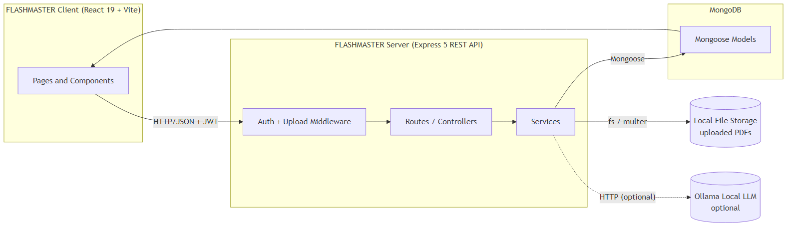

---

## TECHNICAL ARCHITECTURE

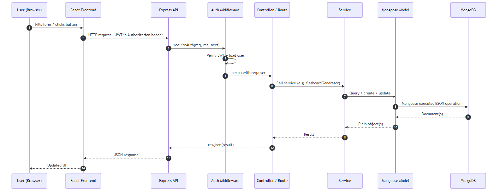

In this architecture, the flow begins with a **user** (Student or Admin) interacting with the **FLASHMASTER frontend** built in React. The user submits an action through the frontend interface — for example, registering a new account, uploading a PDF, browsing flashcards, or creating a study plan.

The FLASHMASTER frontend then sends a request to the **FLASHMASTER backend** built in Express. Every authenticated request carries a JSON Web Token in the `Authorization: Bearer <token>` header, which the backend's `requireAuth` middleware validates before the request reaches any controller. Role-restricted endpoints (e.g., the admin dashboard) additionally pass through `requireRole('admin')`.

The backend processes the request and the associated data. For example, when a user uploads a PDF, the request first passes through the **Multer** middleware, which writes the file to local disk storage with a unique filename and validates its size and MIME type. The controller then calls **`pdf-parse`** to extract text from the file, hands the text to the **flashcard generator service**, and persists both the StudyMaterial document and the generated Flashcard documents to MongoDB.

The backend communicates with the **MongoDB database** through Mongoose models to store all user data securely. The database stores accounts, hashed passwords, materials, flashcards, study plans, progress entries, and notifications.

Additionally, the backend may utilise the **local file storage** system to persist uploaded PDF files and the **Ollama local LLM** to generate higher-quality flashcards when available. If Ollama is not running, the system gracefully falls back to the deterministic heuristic generator and reports the source used in the API response.

Once the backend has processed the request, it sends a JSON response back to the FLASHMASTER frontend. The frontend then updates the UI to display the result to the user — a new flashcard set, an updated dashboard, or a confirmation message.

---

## ER DIAGRAM

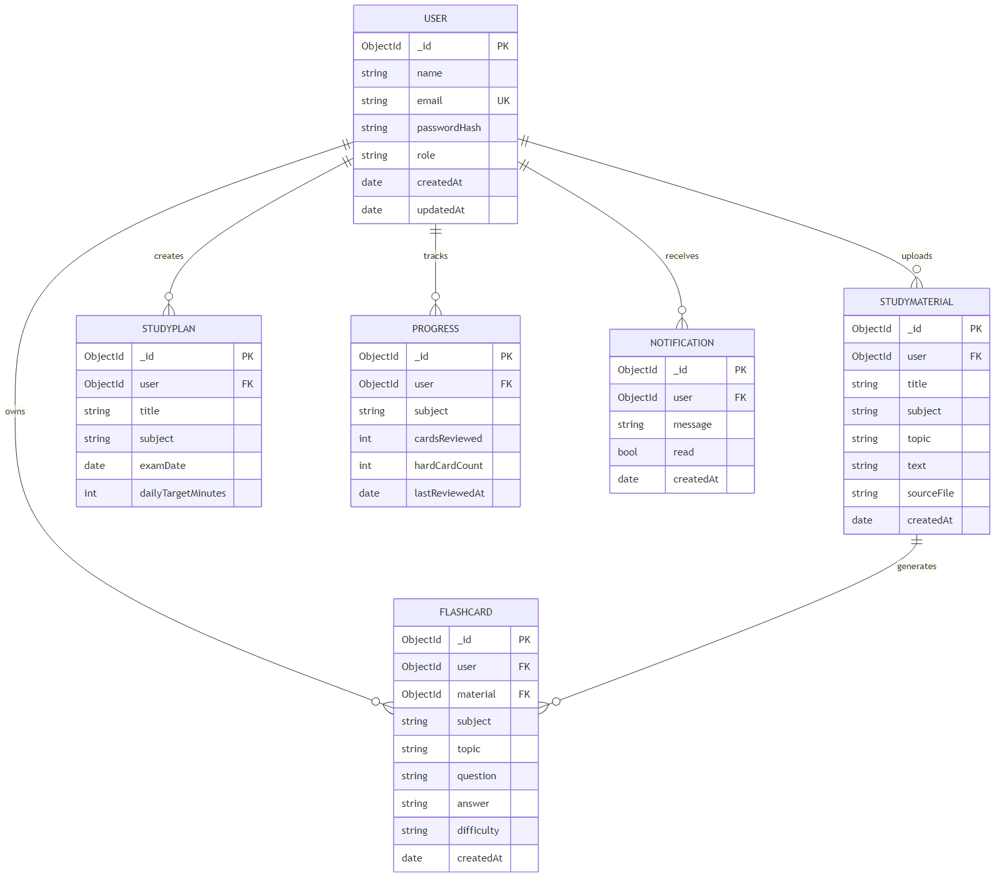

The Entity-Relationship (ER) diagram for FLASHMASTER represents the various entities and their relationships within the exam-preparation management system. Here is a description of the key components of the ER diagram:

### 1. Entities

- **User:** Represents people who use the platform — both students and admins. Attributes: `_id`, `name`, `email`, `passwordHash`, `role` (`student` | `admin`), `createdAt`, `updatedAt`.
- **StudyMaterial:** Represents an uploaded note (PDF or pasted text) that belongs to a user. Attributes: `_id`, `user` (ref → User), `title`, `subject`, `topic`, `text`, `sourceFile`, `createdAt`, `updatedAt`.
- **Flashcard:** Represents a single question–answer card generated from or attached to a study material. Attributes: `_id`, `user` (ref → User), `material` (ref → StudyMaterial), `subject`, `topic`, `question`, `answer`, `difficulty` (`easy` | `medium` | `hard`), `createdAt`, `updatedAt`.
- **StudyPlan:** Represents a user's plan for an upcoming exam. Attributes: `_id`, `user` (ref → User), `title`, `subject`, `examDate`, `dailyTargetMinutes`, `createdAt`, `updatedAt`.
- **Progress:** Represents per-subject revision progress for a user. Attributes: `_id`, `user` (ref → User), `subject`, `cardsReviewed`, `hardCardCount`, `lastReviewedAt`, with a unique compound index on `(user, subject)`.
- **Notification:** Represents a system or admin message addressed to a user. Attributes: `_id`, `user` (ref → User), `message`, `read`, `createdAt`.

### 2. Relationships

- **User → StudyMaterial (1:N):** A user owns many study materials; every material belongs to exactly one user.
- **StudyMaterial → Flashcard (1:N):** A material produces many flashcards; every flashcard belongs to exactly one material (and inherits its subject + topic).
- **User → Flashcard (1:N):** Flashcards are also scoped to the owning user for fast queries and ownership checks.
- **User → StudyPlan (1:N):** A user creates and owns many study plans.
- **User → Progress (1:N):** A user accumulates one Progress record per subject (enforced by the unique `(user, subject)` index).
- **User → Notification (1:N):** Notifications are addressed to a single user.

### 3. Attributes

Each entity has its own set of attributes that describe its properties. For example, the `Flashcard` entity has attributes such as `question`, `answer`, `subject`, `topic`, and `difficulty`, while the `StudyPlan` entity has `subject`, `examDate`, and `dailyTargetMinutes`.

### 4. Primary Keys

Each entity has a primary key that uniquely identifies each record. In MongoDB, every document has an automatically generated `_id` field of type `ObjectId` that serves as the primary key.

### 5. Foreign Keys

Foreign keys are implemented as `ObjectId` references with `ref: 'User'`, `ref: 'StudyMaterial'`, etc. For example, the `Flashcard` model has a `user` field that references the `User` collection and a `material` field that references the `StudyMaterial` collection. Mongoose's `.populate()` method is then used to join these references at query time.

Overall, the ER diagram for FLASHMASTER provides a visual representation of the database schema, showing how different entities are related and how data flows between them in the exam-preparation management system.

---

## Key Features

The key features of the FLASHMASTER application cover the complete student revision workflow:

- **User Registration and Profiles:** Allow users to create accounts, sign in securely with JWT, and manage their personal information.
- **Multi-Format Material Upload:** Upload notes as PDF files or paste raw text directly. PDFs are parsed automatically and the extracted text is stored alongside the original file.
- **Automatic Flashcard Generation:** Every uploaded material is converted into question–answer flashcards using a heuristic pattern matcher, with optional upgrading to a local LLM (Ollama) when available.
- **Manual Flashcard Authoring:** Users can also create, edit, and delete flashcards by hand, useful for niche material or hand-written notes.
- **Subject and Topic Organisation:** Every material and flashcard carries a subject and an optional topic, with filter chips on every list page so the library always stays browsable.
- **Study Mode with Difficulty Tagging:** A focused single-card study view lets users reveal answers and rate each card as Easy, Medium, or Hard, feeding into both the per-card record and the platform analytics.
- **Study Plans with Countdown:** Create plans tied to upcoming exams and see a "days until exam" countdown surfaced on the dashboard.
- **Progress Tracking:** Per-subject progress is recorded and aggregated, including total cards reviewed, hard-card count, and last-reviewed timestamp.
- **Analytics Dashboard:** A dedicated Analytics page surfaces user-level stats — distribution of difficulty, materials per subject, and revision velocity.
- **Notifications:** In-app bell-icon notifications inform users about generation jobs, plan deadlines, and admin announcements.
- **Admin Dashboard:** A role-gated dashboard with three tabs — **Users** (list and role view), **Materials** (every uploaded file with delete capability), and **Reports** (platform-wide statistics).
- **Graceful AI Fallback:** When the optional Ollama LLM is offline, the heuristic generator runs automatically and the API response reports which generator produced the cards.

These features are tailored specifically for FLASHMASTER's target audience — university and school students who want to convert raw notes into focused, trackable revision.

---

## ROLES AND RESPONSIBILITIES

### Student (default user)

- **Registration and Account Management:** Students are responsible for creating an account, providing accurate personal information, and managing their account details, including profile updates and password security.
- **Material Upload and Organisation:** Students upload their own notes as PDFs or pasted text, tag each upload with a subject and an optional topic, and keep their library tidy by deleting or relabelling materials they no longer need.
- **Flashcard Review:** Students browse and study their generated flashcards, enter Study Mode, reveal answers, and tag each card as Easy, Medium, or Hard. They are responsible for honest self-assessment so the difficulty data stays meaningful.
- **Study Plan Creation:** Students create study plans for upcoming exams by entering the subject, exam date, and daily targets. They are responsible for keeping their plans up to date as exam dates change.
- **Progress Self-Tracking:** Students review their Analytics page regularly to identify weak subjects and adjust their study focus accordingly.
- **Communication:** Students may receive in-app notifications from admins or the system, and should pay attention to deadline alerts.

### Admin

- **System Management:** The admin is responsible for overall management and administration of the FLASHMASTER platform. This includes monitoring system performance, ensuring data security and privacy, and managing platform-wide settings.
- **User Management:** The admin can view all registered users from the Users tab of the admin dashboard, see each user's role, and (in future iterations) suspend or terminate accounts that violate platform guidelines.
- **Content Moderation:** The admin oversees every uploaded study material from the Materials tab. They can remove any inappropriate or copyright-infringing upload, with cascade deletion of the associated flashcards.
- **Reporting and Insights:** The admin reviews the Reports tab to see platform-wide counts — total users, students, admins, materials, flashcards, hard-card count, plans, and recent uploads — and uses this to make data-informed product decisions.
- **Announcements:** The admin can issue platform-wide notifications when needed.

---

## User Flow

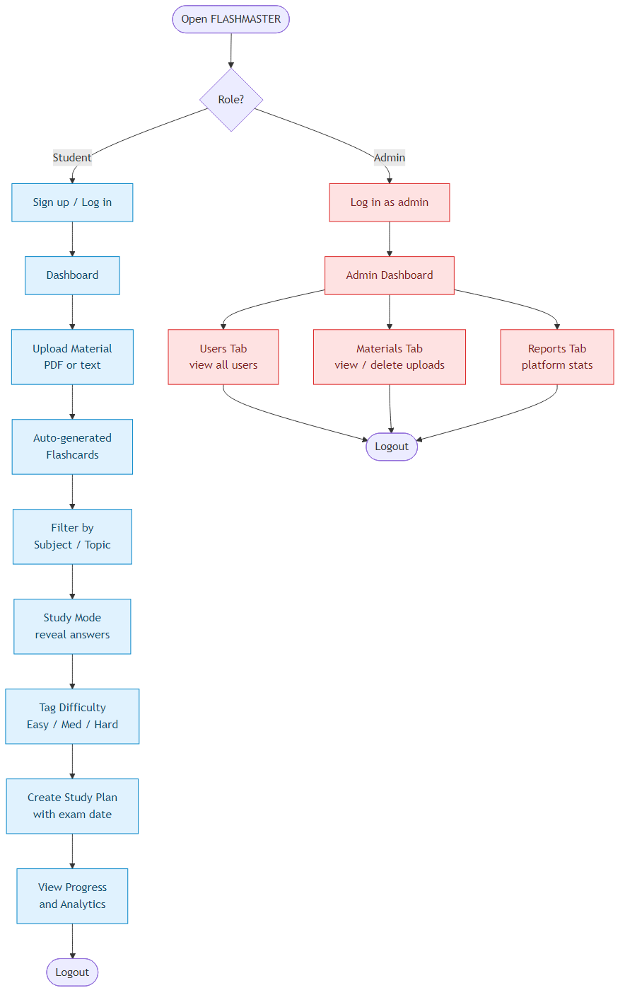

### Student Flow

- **Registration & Account** – Create an account with name, email, and password; receive a JWT and stay logged in.
- **Upload Material** – Upload a PDF or paste raw text, tag it with subject and optional topic.
- **Auto-Generated Flashcards** – Cards appear automatically on the Flashcards page after upload.
- **Filter & Study** – Filter by subject/topic, enter Study Mode, reveal answers, and tag difficulty.
- **Plan & Track** – Create study plans for upcoming exams, watch the days-until countdown, monitor progress in Analytics.
- **Stay Notified** – Watch the notification bell for generation completion, deadline alerts, and admin messages.

### Admin Flow

- **Login** – Log in with admin credentials (admin role assigned via `scripts/make-admin.js`).
- **Users Tab** – Review the registered user list with roles.
- **Materials Tab** – Browse every uploaded file across the platform, with owner information, and remove any inappropriate content.
- **Reports Tab** – Inspect platform-wide statistics for usage, content health, and revision activity.

---

## MVC PATTERN

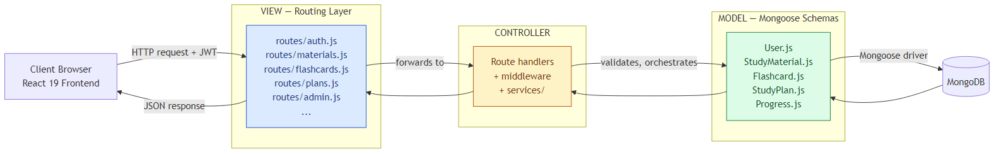

The FLASHMASTER application follows the **Model-View-Controller (MVC)** architectural pattern, a software design approach that separates an application into three interconnected layers. This separation allows for modularity, easier maintenance, and scalability.

### Model Layer (Data Layer)

The Model layer is responsible for handling all data-related logic. This includes the definition of data schemas and the operations performed on the database using those schemas. The models are implemented using **Mongoose**, which provides a schema-based solution to model application data for MongoDB. FLASHMASTER's models live in `server/src/models/` and include `User`, `StudyMaterial`, `Flashcard`, `StudyPlan`, and `Progress`.

### Controller Layer

The Controller layer acts as an intermediary between the View (routes) and the Model. It receives incoming requests, processes the input (which may include validation, authentication, or transformation), calls the appropriate methods from the model, and then returns a response to the client. In FLASHMASTER, controller logic is co-located with the route definitions in `server/src/routes/` for compactness, and the heaviest business logic — flashcard generation, plan generation, Ollama integration — is extracted into pure-function services in `server/src/services/`.

### View Layer (Routing Layer / React Frontend)

In the context of a backend REST API, the View is implemented as the routing layer, where various endpoints are defined. These endpoints determine how the backend responds to different HTTP requests (GET, POST, PUT, DELETE, PATCH) and are responsible for invoking the appropriate controller logic. In FLASHMASTER, route files live in `server/src/routes/` (`auth.js`, `users.js`, `materials.js`, `flashcards.js`, `plans.js`, `progress.js`, `admin.js`, `notifications.js`).

The user-facing View layer is the **React 19** frontend in `client/src/`, which consumes the JSON API and renders every screen.

### Advantages of Using MVC in This Project

- **Separation of Concerns:** Each layer has a clearly defined responsibility, improving readability and maintainability.
- **Scalability:** New features can be added easily by creating new routes, controllers, and models without touching unrelated code.
- **Reusability:** Logic in services and models can be reused across multiple routes — for example, the flashcard generator service is called by both the upload route and the manual regenerate endpoint.
- **Testing:** Each layer can be tested independently, especially the pure-function services and Mongoose models.
- **Collaboration-Friendly:** Multiple developers can work simultaneously on different layers without conflict.

---

## Project Setup And Configuration

### Creating the project folder

1. Create a new folder named `FLASHCARDS`.
2. Inside that folder create two new folders.
3. Name one as **`client`**.
4. Name another as **`server`**.
5. Open that folder in VS Code.

### Client setup (Vite + React)

Open the `client` folder in the terminal of VS Code.

```bash
npm create vite@latest . -- --template react
```

- Select **React** framework from the given options.
- Select the **JavaScript** variant.

Now install the packages and start the dev server:

```bash
cd client
npm install
npm install react-router-dom
npm install -D tailwindcss @tailwindcss/vite
npm run dev
```

### Server setup (npm init)

Open the `server` folder in the terminal of VS Code.

```bash
npm init -y
npm install express mongoose dotenv cors jsonwebtoken bcrypt multer pdf-parse
npm install -D nodemon
```

Edit `server/package.json` to add `"type": "module"` (for ES module syntax) and the dev script:

```json
"scripts": {
  "dev": "nodemon src/index.js",
  "start": "node src/index.js"
}
```

Create the folder structure:

```
server/
└── src/
    ├── index.js
    ├── config/
    ├── models/
    ├── routes/
    ├── middleware/
    └── services/
```

### Root setup (one-command dev)

In the project root, install `concurrently` so both servers start with one command:

```bash
npm init -y
npm install -D concurrently
```

Add this to the root `package.json`:

```json
"scripts": {
  "dev": "concurrently -n \"server,client\" -c \"blue,magenta\" \"npm --prefix server run dev\" \"npm --prefix client run dev\"",
  "install:all": "npm install && npm --prefix server install && npm --prefix client install"
}
```

Now `npm run dev` from the project root boots both the Express API and the Vite dev server in parallel.

---

## BACKEND DEVELOPMENT

### Backend Structure

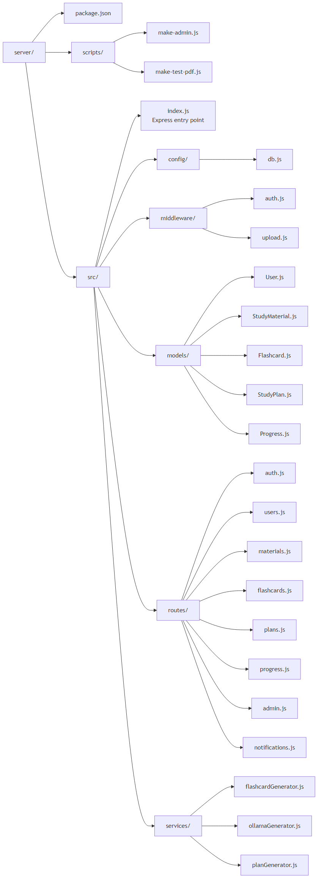

```
server/
├── package.json
├── scripts/
│   ├── make-admin.js          # Promote a user to admin role
│   └── make-test-pdf.js       # Generate a sample PDF for testing
└── src/
    ├── index.js               # Express app entry, route mounting, error handler
    ├── config/
    │   └── db.js              # MongoDB connection via Mongoose
    ├── middleware/
    │   ├── auth.js            # requireAuth + requireRole (JWT validation)
    │   └── upload.js          # Multer disk storage with size + MIME limits
    ├── models/
    │   ├── User.js            # User schema (email, passwordHash, role)
    │   ├── StudyMaterial.js   # Uploaded notes (PDF or text)
    │   ├── Flashcard.js       # Q/A cards with difficulty + subject + topic
    │   ├── StudyPlan.js       # Exam plans with countdown
    │   └── Progress.js        # Per-(user,subject) revision progress
    ├── routes/
    │   ├── auth.js            # POST /signup, /login, GET /me
    │   ├── users.js           # User profile CRUD
    │   ├── materials.js       # Upload + list + delete materials
    │   ├── flashcards.js      # CRUD + study/review endpoints
    │   ├── plans.js           # Study plan CRUD
    │   ├── progress.js        # Progress upserts
    │   ├── admin.js           # Admin-only platform routes
    │   └── notifications.js   # In-app notifications
    └── services/
        ├── flashcardGenerator.js  # Heuristic Q/A generator
        ├── ollamaGenerator.js     # Local LLM Q/A generator
        └── planGenerator.js       # Auto-build a study plan
```

### Controllers (route files)

- **`auth.js`** → Handles signup, login, and the `/me` endpoint. Uses bcrypt to hash and verify passwords; signs JWTs with `jsonwebtoken`.
- **`users.js`** → User profile read and update endpoints.
- **`materials.js`** → Handles file upload (Multer + pdf-parse), listing scoped to `req.user`, filtering by `?subject=` and `?topic=`, and deletion (with cascade of associated flashcards).
- **`flashcards.js`** → Full CRUD for flashcards, including the `?replace=true` regenerate endpoint and the difficulty-tagging endpoint that updates the `Progress` document on every review.
- **`plans.js`** → Study plan CRUD; the list endpoint computes `daysUntilExam` for each plan.
- **`progress.js`** → Read-only progress endpoints aggregated from the difficulty taps in `flashcards.js`.
- **`admin.js`** → Role-gated platform routes: list every user, list/delete every material, and `GET /api/admin/stats` for platform-wide counts.
- **`notifications.js`** → List, mark-as-read, and create notifications.

### Database connection (`config/db.js`)

Contains the MongoDB connection setup using Mongoose. The `MONGO_URI` is loaded from `.env` via `dotenv` and connection is established before the Express server starts listening.

### Middleware

- **`authMiddleware (auth.js)`** → Reads the `Authorization: Bearer <token>` header, verifies the JWT, attaches `req.user`, and rejects unauthenticated requests with 401. The companion `requireRole('admin')` rejects with 403 when the role doesn't match.
- **`upload.js`** → Multer middleware for handling file uploads. Configured for disk storage with size limits and a MIME-type allow-list (PDFs only).

### Models

- **User**
  - `Users.js` → Schema/model for user accounts (email unique, passwordHash hidden from JSON via `select: false` and a `toJSON` transform, role enum `student | admin`).
- **Study Material**
  - `StudyMaterial.js` → Schema/model for an uploaded note. Carries `title`, `subject`, optional `topic`, the extracted `text`, and `sourceFile` path when uploaded as a PDF.
- **Flashcards**
  - `Flashcard.js` → Schema/model for individual Q/A flashcards with `question`, `answer`, `subject`, `topic`, `difficulty` enum, and refs to `user` and `material`.
- **Study Plan**
  - `StudyPlan.js` → Schema/model for an exam plan with `examDate`, `subject`, and `dailyTargetMinutes`.
- **Progress**
  - `Progress.js` → Schema/model for per-(user, subject) revision progress with `cardsReviewed`, `hardCardCount`, and `lastReviewedAt`. Has a unique compound index on `(user, subject)` to enforce upsert semantics.

### Routes

- `auth.js` → `POST /api/auth/signup`, `POST /api/auth/login`, `GET /api/auth/me`.
- `materials.js` → `GET /api/materials`, `POST /api/materials` (text), `POST /api/materials/upload` (PDF), `DELETE /api/materials/:id`.
- `flashcards.js` → `GET /api/flashcards`, `POST /api/flashcards`, `PATCH /api/flashcards/:id`, `DELETE /api/flashcards/:id`, `POST /api/flashcards/regenerate/:materialId?replace=true`, `POST /api/flashcards/:id/review`.
- `plans.js` → `GET /api/plans`, `POST /api/plans`, `PATCH /api/plans/:id`, `DELETE /api/plans/:id`.
- `progress.js` → `GET /api/progress`.
- `admin.js` → `GET /api/admin/users`, `GET /api/admin/materials`, `DELETE /api/admin/materials/:id`, `GET /api/admin/stats`.
- `notifications.js` → `GET /api/notifications`, `PATCH /api/notifications/:id/read`.

---

## DATABASE DEVELOPMENT

### 1. Configure MongoDB

- Install Mongoose. In the server directory, run:

  ```bash
  npm install mongoose
  ```

- Create the database connection.
- Create Schemas & Models.

### Create Database connection

Make sure the database is connected before performing any of the actions through the backend. The connection code looks similar to the one provided below:

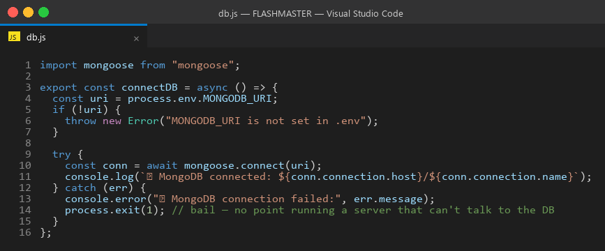

The connection is invoked from `server/src/index.js` before the Express app starts listening on its port.

### Create Schemas

Firstly, configure the Schemas for the MongoDB database, to store the data in such a pattern. Use the data from the ER diagrams to create the schemas. The Schemas for this application look alike to the ones provided below.

#### 1) User.js → Schema/model for user accounts

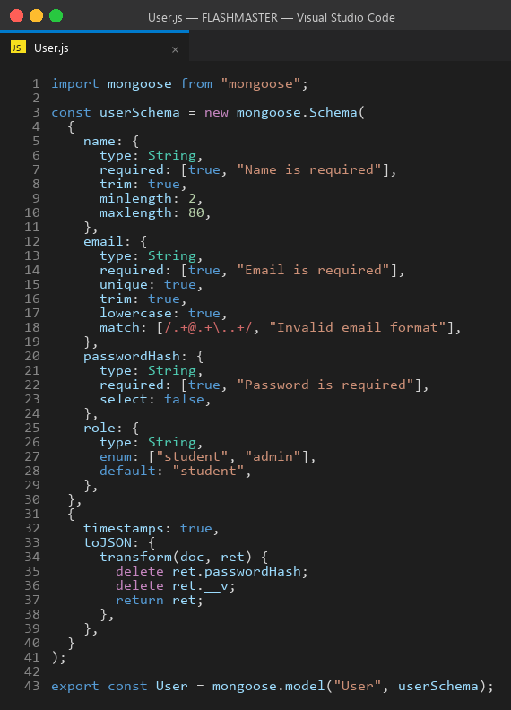

#### 2) StudyMaterial.js → Schema/model for uploaded notes

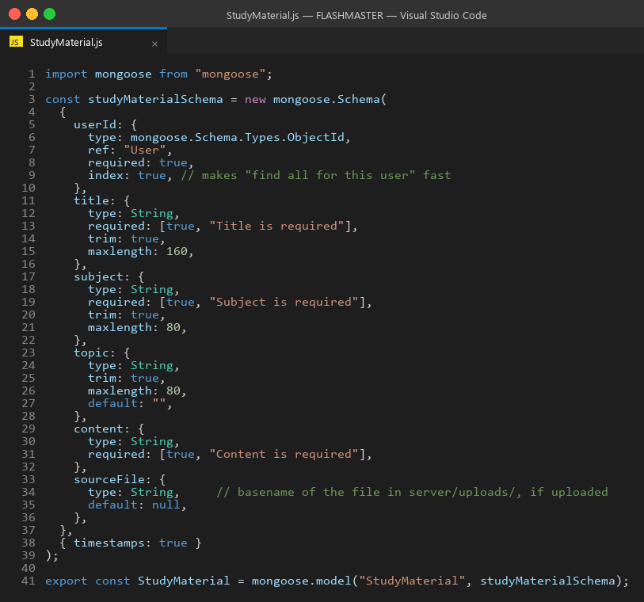

#### 3) Flashcard.js → Schema/model for question–answer cards

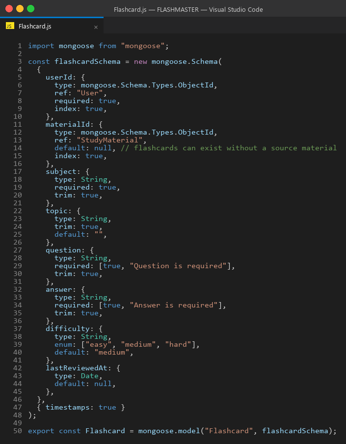

#### 4) StudyPlan.js → Schema/model for exam study plans

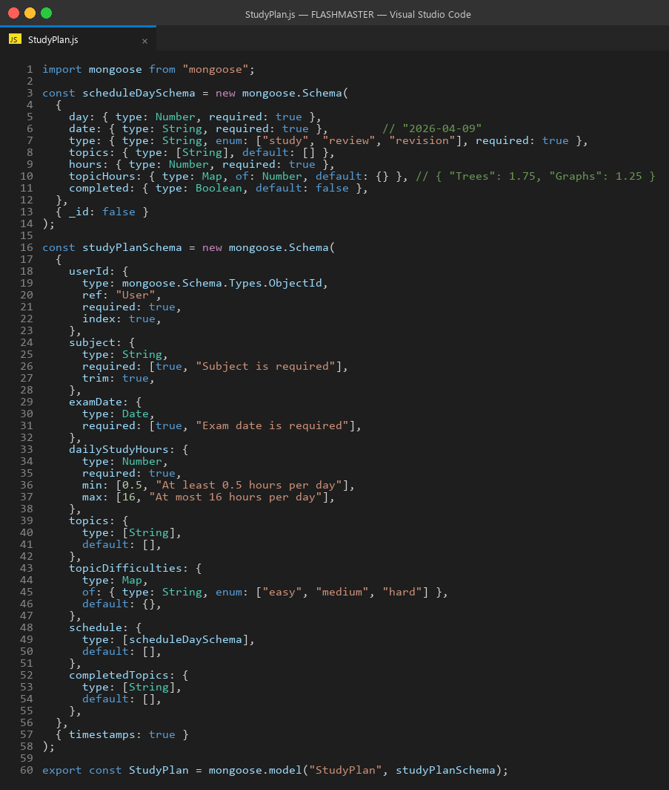

#### 5) Progress.js → Schema/model for per-subject revision progress

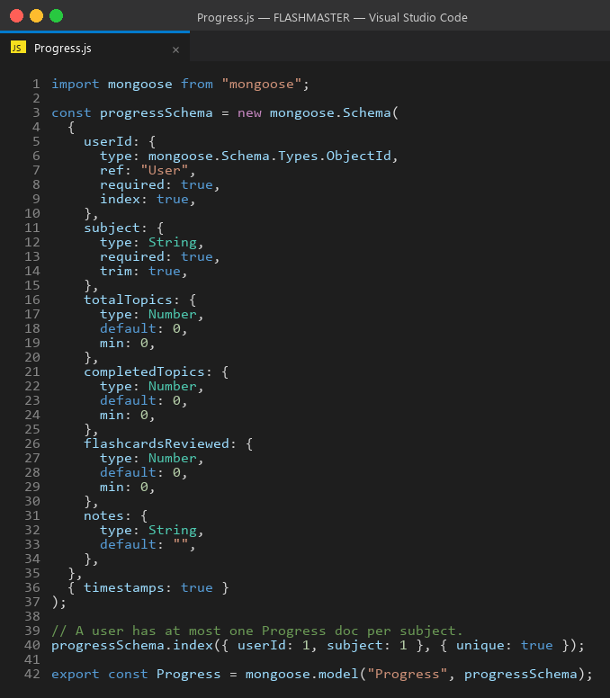

---

## FRONT-END DEVELOPMENT

### Frontend Structure

```
client/
├── package.json
├── vite.config.js
├── index.html
└── src/
    ├── main.jsx               # React root + router
    ├── App.jsx                # Top-level routes + layout
    ├── components/
    │   ├── Navbar.jsx         # Top navigation bar
    │   ├── NotificationBell.jsx  # In-app notifications dropdown
    │   └── ProtectedRoute.jsx # Auth + role guard for routes
    ├── lib/
    │   ├── api.js             # Fetch wrapper that injects JWT
    │   └── auth.jsx           # AuthContext + useAuth hook
    └── pages/
        ├── Home.jsx           # Public landing page
        ├── Login.jsx          # Sign-in form
        ├── Signup.jsx         # Registration form
        ├── Dashboard.jsx      # Authenticated home with stats
        ├── Materials.jsx      # Upload + list + delete materials
        ├── Flashcards.jsx     # Browse + study mode
        ├── Plans.jsx          # Study plan CRUD with countdown
        ├── Progress.jsx       # Per-subject progress view
        ├── Analytics.jsx      # Charts + stats
        └── Admin.jsx          # Admin dashboard (Users / Materials / Reports tabs)
```

### Pages (`src/pages`)

- **`Home.jsx`** → Public landing page with the FLASHMASTER pitch and CTAs to sign in or sign up.
- **`Login.jsx`** → Sign-in form; on success stores the JWT in `localStorage` and redirects to the Dashboard.
- **`Signup.jsx`** → Registration form for new students.
- **`Dashboard.jsx`** → Authenticated home page with quick stats: number of materials, flashcards, upcoming exam countdowns, and recent activity.
- **`Materials.jsx`** → Upload form (PDF upload + raw text), filterable list of materials by subject/topic, with delete buttons.
- **`Flashcards.jsx`** → Filterable flashcards list, study mode toggle, reveal-answer interaction, difficulty tagging buttons.
- **`Plans.jsx`** → Study plan create / edit / delete with the days-until-exam countdown badge on every card.
- **`Progress.jsx`** → Per-subject progress view (cards reviewed, hard count, last review date).
- **`Analytics.jsx`** → Cross-cutting analytics view of difficulty distribution and subject coverage.
- **`Admin.jsx`** → Role-gated dashboard with three tabs: **Users**, **Materials**, **Reports**.

### Components (Reusable parts)

- **`Navbar.jsx`** → Top navigation bar that adapts based on auth state and user role (admin sees the Admin link).
- **`NotificationBell.jsx`** → Dropdown in the navbar that lists unread notifications and lets the user mark them as read.
- **`ProtectedRoute.jsx`** → Wrapper component that checks auth + role and redirects unauthenticated visitors to the Login page.

### Lib (utilities)

- **`api.js`** → Centralised fetch wrapper that prefixes the API base URL, attaches the JWT from `localStorage` to every request, and surfaces server errors to the caller.
- **`auth.jsx`** → React Context that exposes the current user, the login/logout functions, and the loading state to every component via the `useAuth()` hook.

---

## Output Screenshots

> Screenshots of the live application are stored in the `ss/` folder of the repository. See `SCREENSHOT_GUIDE.md` for capture instructions.

**Landing Page**


**Signup Page (Student)**


**Login Page**


**Student Dashboard**


**Materials Page (upload + list)**


**Flashcards Page (filter + study mode)**


**Study Plans Page (with countdown)**


**Progress Page (per-subject stats)**


**Analytics Page**


**Admin Dashboard – Users Tab**


**Admin Dashboard – Materials Tab**


**Admin Dashboard – Reports Tab**


---

## Project Overview Video

[Watch the FLASHMASTER project overview video on Google Drive](https://drive.google.com/file/d/13laCkmfLTP5Do-R4tMpo0vT3qxWe7One/view?usp=sharing)

## Code Explanation Video

[Watch the FLASHMASTER code explanation video on Google Drive](https://drive.google.com/file/d/193JGzvS2ED0ILRLsKOAN6gDrgnrdhGzX/view?usp=drive_link)

## GitHub Repository

[github.com/venkataharshinikanajam-art/flashmaster](https://github.com/venkataharshinikanajam-art/flashmaster)

---

## References

1. **Node.js Documentation** — Official Node.js runtime documentation. https://nodejs.org/en/docs
2. **Express.js Documentation** — Web framework for Node.js, version 5. https://expressjs.com/
3. **MongoDB Manual** — Official documentation for MongoDB Community Edition. https://www.mongodb.com/docs/manual/
4. **Mongoose Documentation** — Object Data Modelling library for MongoDB and Node.js. https://mongoosejs.com/docs/
5. **React Documentation** — Official React 19 documentation. https://react.dev/
6. **Vite Documentation** — Frontend build tool and dev server. https://vitejs.dev/
7. **Tailwind CSS Documentation** — Utility-first CSS framework, version 4. https://tailwindcss.com/docs
8. **React Router Documentation** — Declarative routing for React. https://reactrouter.com/
9. **JSON Web Tokens (JWT) — RFC 7519** — Token format used for stateless authentication. https://datatracker.ietf.org/doc/html/rfc7519
10. **bcrypt — npm package** — Password hashing library used by FLASHMASTER. https://www.npmjs.com/package/bcrypt
11. **Multer — npm package** — Express middleware for handling `multipart/form-data` file uploads. https://www.npmjs.com/package/multer
12. **pdf-parse — npm package** — Pure-JS library for extracting text from PDF documents. https://www.npmjs.com/package/pdf-parse
13. **Ollama** — Local large language model runtime used for the optional AI flashcard generator. https://ollama.com/
14. **MDN Web Docs** — JavaScript, HTTP, and Web APIs reference. https://developer.mozilla.org/

---

## Appendix A — Key Code Listings

This appendix contains the source code of the most important files in the FLASHMASTER project, included for reference and academic submission.

### A.1 Backend entry point — `server/src/index.js`

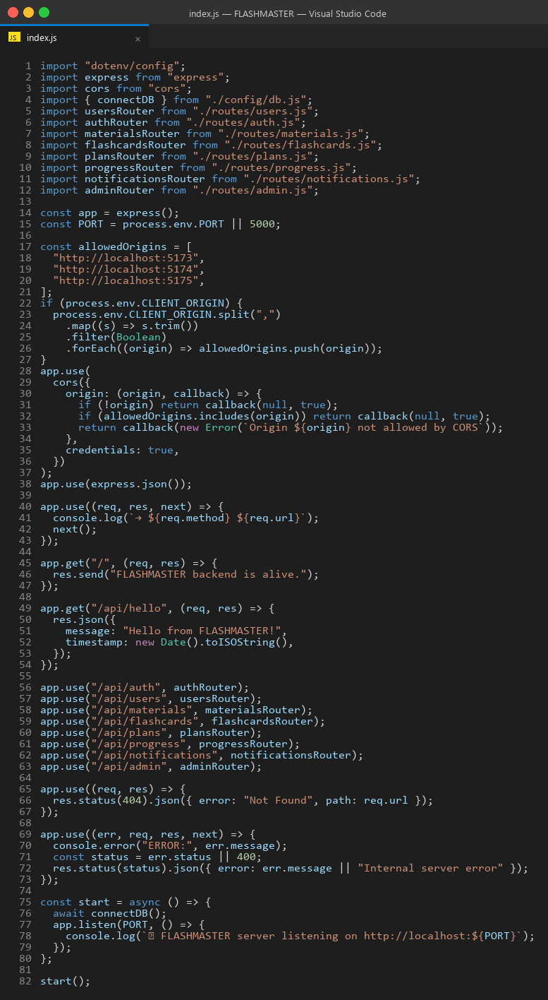

### A.2 User model — `server/src/models/User.js`


### A.3 Authentication middleware — `server/src/middleware/auth.js`

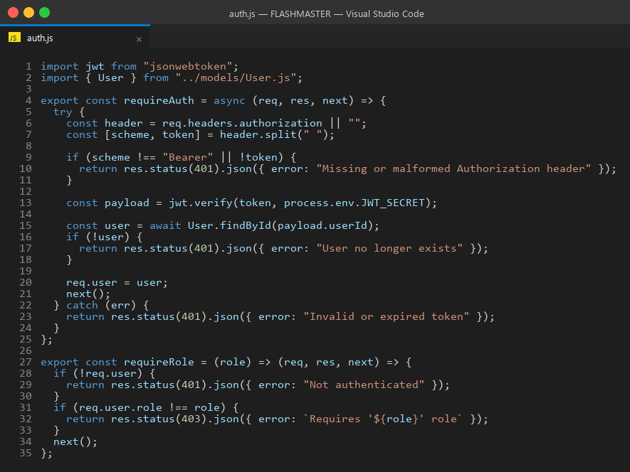

### A.4 Flashcard generator service — `server/src/services/flashcardGenerator.js`

The deterministic, pure-function flashcard generator. Recognises four sentence patterns: "X is Y", "X are Y", "X means Y", and "X: Y".

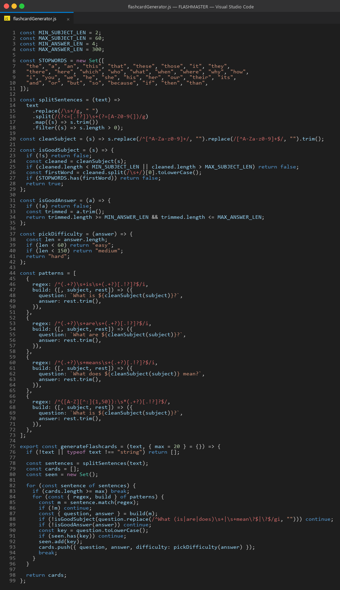

### A.5 Database connection — `server/src/config/db.js`


> The remaining route, model, and service files follow the same conventions and can be inspected in the source repository.

---

*End of report.*
